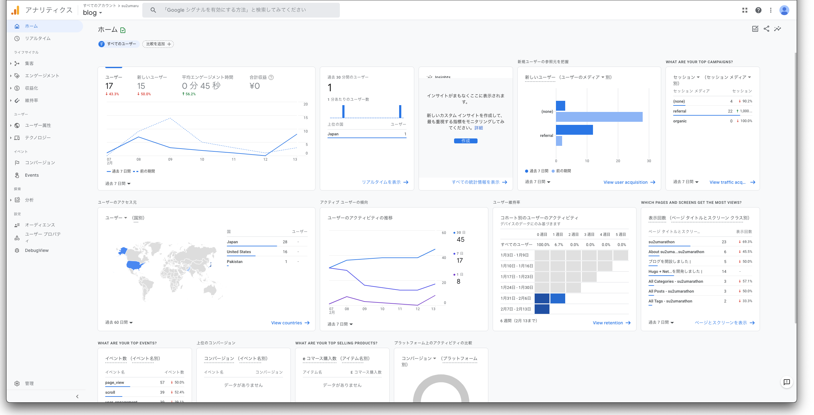

[@su2umaru](https://twitter.com/su2umaru) です。ブログに Google Analytics を設定しました。Hugo で開発したサイトに Google Analytics (gtag.js バージョン) を設定する方法を書きます。

<!--more-->

## アクセス解析サービス Google Analytics

Google Analytics は Google が提供するアクセス解析サービスです。

[Google マーケティング プラットフォーム](https://marketingplatform.google.com/intl/ja/about/analytics/)によると、ユーザ像を詳しく分析し、ビジネスの拡大に役立つ的確なインサイトを無料で取得できる、とのことです。

「どのような方が、どれくらいの方が、どのページを読んでくださっているのか計測したい」

Hugo + Netlify で開発した自作ブログに Google Analytics を導入しました。

## Hugo で開発したサイトへの Google Analytics 設定

3ステップで Google Analytics を設定できます。

1. Google アカウントを作成する
2. Google Analytics アカウントを作成する
3. トラッキングコード (gtag.js もしくは analytics.js) を埋め込む

僕は既に Google アカウントを持っていたので、[Google Analytics のサイト](https://analytics.google.com/analytics/web/)から Google Analytics アカウントを作成しました。

Google Analytics アカウントを作成すると、トラッキングコードが表示されます。トラッキングコードには2種類あります。gtag.js が新しいバージョン、analytics.js が古いバージョンです。僕は新しいバージョンである gtag.js を選びました。

[前回の記事「Hugo + Netlify で自作ブログを開発しました」](https://su2umarathon.netlify.app/hugo-netlify/)で書いたように、su2umarathon は Hugo で開発されています。Hugo で開発したサイトにトラッキングコードを埋め込むために [config.toml](https://github.com/su2umaru/blog/blob/df2f4d8ffd2a3f4d42652187e10e70a0ce16a8ee/config.toml#L199) を編集しました。

```toml
# Analytics config
[params.analytics]
  enable = true
  # Google Analytics
  [params.analytics.google]
    # [UA-XXXXXXXX-X] google analytics code
    id = "G-8Y77HLS0Y2"
    # whether to use gtag linked
    gtag = true
    # whether to anonymize IP
    anonymizeIP = true
```

gtag.js の場合、`id` に `G-` から始まるコード、また `gtag` に `true` を設定します。analytics.js の場合、`id` に `UA-` から始まるコード、また `gtag` に `false` を設定します。

[config.toml](https://github.com/su2umaru/blog/blob/df2f4d8ffd2a3f4d42652187e10e70a0ce16a8ee/config.toml#L199) で設定したパラメータは、[uBlogger テーマ](https://github.com/uPagge/uBlogger)の [analytics.html](https://github.com/uPagge/uBlogger/blob/master/layouts/partials/plugin/analytics.html) で読み込まれます。

```html
{{- $analytics := .Scratch.Get "analytics" | default dict -}}

{{- if $analytics.enable -}}
    {{- /* Google Analytics */ -}}
    {{- with $analytics.google.id -}}
        {{- if $analytics.google.gtag -}}
            <script>
                window.dataLayer=window.dataLayer||[];function gtag(){dataLayer.push(arguments);}gtag('js', new Date());
                gtag('config', '{{ . }}'{{ if $analytics.google.anonymizeIP }}, { 'anonymize_ip': true }{{ end }});
            </script>
            {{- printf "https://www.googletagmanager.com/gtag/js?id=%v" . | dict "Async" true "Source" | partial "plugin/script.html" -}}
        {{- else -}}
            <script>
                (function(i,s,o,g,r,a,m){i['GoogleAnalyticsObject']=r;i[r]=i[r]||function(){
                (i[r].q=i[r].q||[]).push(arguments)},i[r].l=1*new Date();a=s.createElement(o),
                m=s.getElementsByTagName(o)[0];a.async=1;a.src=g;m.parentNode.insertBefore(a,m)
                })(window,document,'script','https://www.google-analytics.com/analytics.js','ga');

                ga('create', '{{ . }}', 'auto');
                {{ if $analytics.google.anonymizeIP }}ga('set', 'anonymizeIp', true);{{ end }}
                ga('send', 'pageview');
            </script>
        {{- end -}}
    {{- end -}}
{{- end -}}
```

「パラメータ `id` と `gtag` の設定だけで完了するなんて簡単」

驚くほど簡単にトラッキングコードを埋め込めました。

## ブログのアクセス解析

3ステップで Google Analytics の設定を終えると、アクセス解析が開始されます。



- 日ごとのユーザ数
- 直近30分間のユーザ数
- ユーザの参照元
- ユーザのアクセス元
- 各ページの表示回数
- イベント数
- コンバージョン数

用途に合わせて数値を分析できます。su2umarathon はブログなので、日ごとのユーザ数と各ページの表示回数が重要な指標です。これらの指標は Google Analytics を設定するきっかけとなった思いを叶えます。

「どのような方が、どれくらいの方が、どのページを読んでくださっているのか計測したい」

僕の思いに応じて、重要な指標が日ごとのユーザ数と各ページの表示回数となります。思いが異なれば、それに応じて重要な指標も異なります。

Google Analytics のアクセス解析によりデータは貯まります。そのデータをいかに活用するか、思いと相談です。

## Google Analytics を見て喜べるように良い記事を書きます