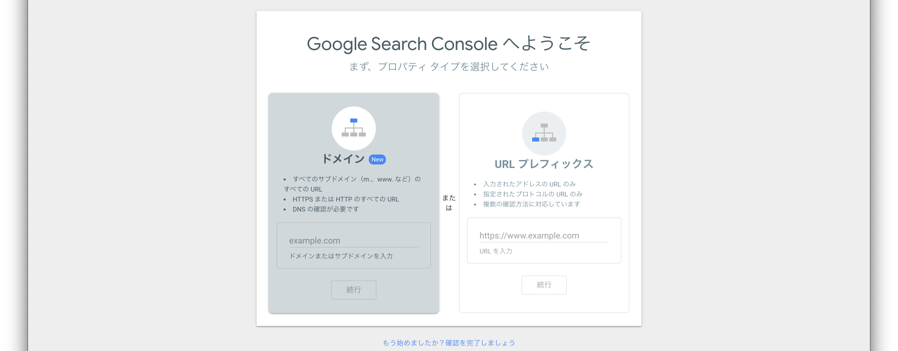
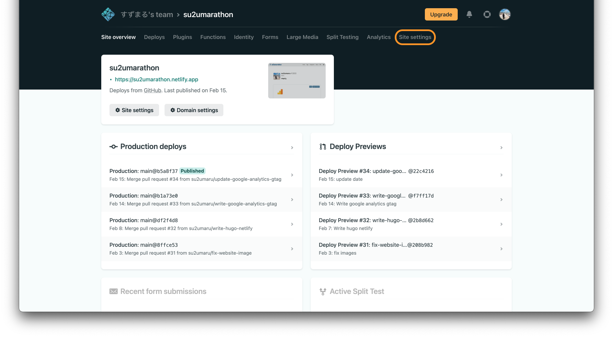
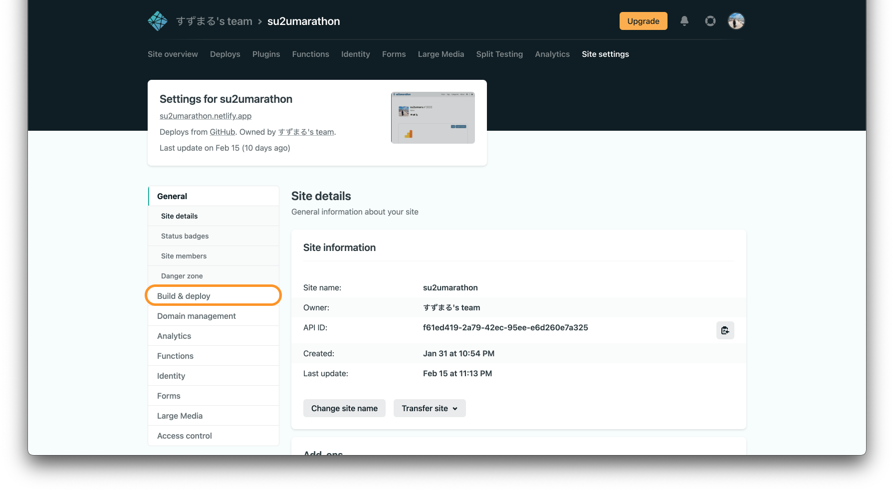
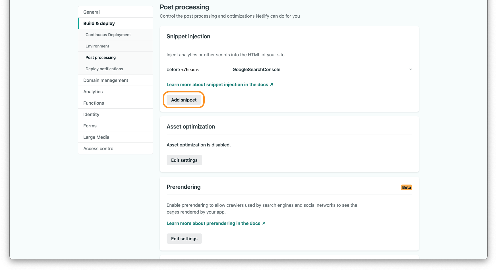
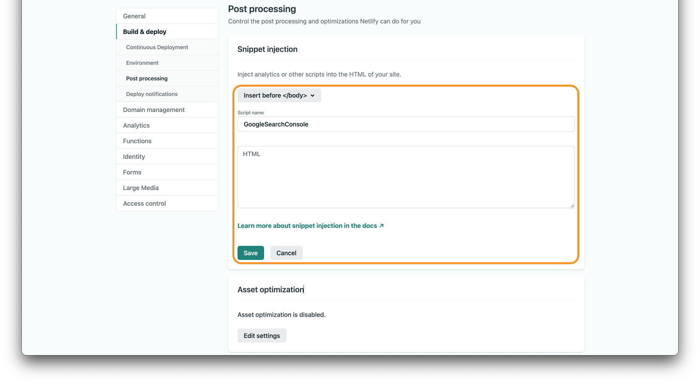
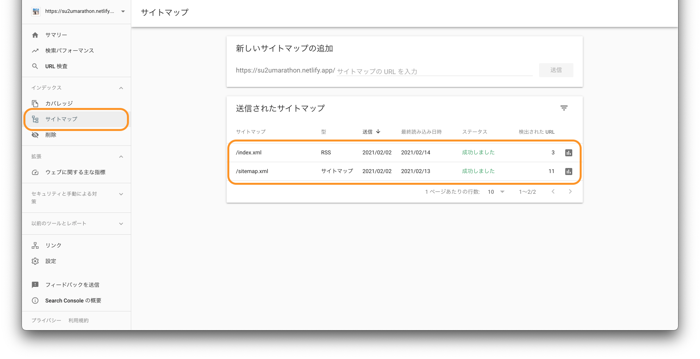
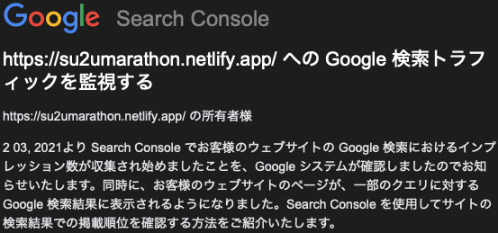
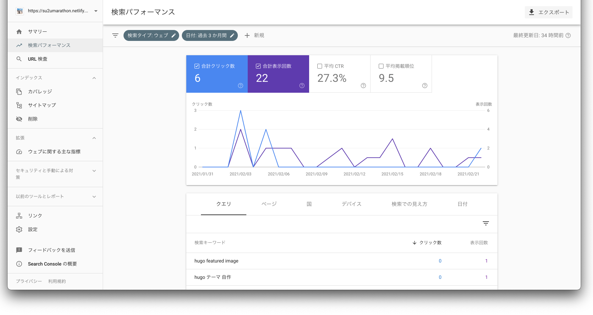

[@su2umaru](https://twitter.com/su2umaru) です。ブログに Google Search Console を設定しました。Hugo + Netlify で開発したサイトに Google Search Console を設定する方法を書きます。

<!--more-->

## Google 検索結果での掲載順位改善ツール Google Search Console

Google Search Console は Google が提供する Google 検索結果での掲載順位改善ツールです。

[公式サイト](https://search.google.com/search-console/about?hl=ja)によると、Search Console のツールやレポートを使うことで、サイトの検索トラフィックや掲載順位を測定できるほか、問題を修正し、Google 検索結果でのサイトの注目度を高めることができる、とのことです。

また自作ブログの場合、直接 URL を指定しないとサイトを見ることができません。すなわち Google 検索で自作ブログが検索結果として出てくることはありません。Google 検索で検索されるためにも Google Search Console の設定が必要です。

「Google 検索結果での掲載順位を改善して、多くの方に情報を届けたい」

Hugo + Netlify で開発した自作ブログに Google Search Console を設定しました。

## Hugo + Netlify で開発したサイトへの Google Search Console 設定

4ステップで Google Search Console を設定できます。

1. Google アカウントを作成する
2. Google Search Console にドメインか URL プレフィクスを登録する
3. 所有権を確認する
4. サイトマップを追加する

僕は既に Google アカウントを持っていたので、ステップ2から行いました。[Google Search Console のサイト](https://search.google.com/search-console/welcome?hl=ja)にアクセスすると、プロパティタイプを選択するよう促されます。

ドメインか URL プレフィクスを入力できるようになっており、今回は URL プレフィクスを登録しました。このブログを Netlify でデプロイしており、ドメインを Netlify が提供するもののままにしているためです。ドメインを取得している場合、そのドメインを登録すると、すべてのサブドメインのすべての URL をアクセス解析の対象とします。

Google Search Console に URL プレフィクスを登録すると、所有権を確認するよう促されます。ここでは HTML タグを選択し、表示される meta タグをコピーします。

「下のメタタグをコピーして、サイトのホームページにある \<head\> セクション内の、最初の \<body\> セクションの前に貼り付けます。」と説明があります。

「自分でコピペしなければいけないのか」

そんなことはありませんでした。この処理を自動化してくれるのが Netlify の Snippet injection です。Snippet injection を設定するには、まず Netlify で Google Search Console を設定するサイトのメニュー Site Settings に移動します。

次に Build & deploy に移動します。

Snippet injection の Add snippet から設定できます。

メタタグを \<body\> セクションの前に貼り付けるため、「Insert before \</body\>」を選択します。また Script name にはわかりやすい名前を設定します。今回は「GoogleSearchConsole」としました。そして HTML にコピーしたメタタグを貼り付けます。

所有権を確認したら、サイトマップを追加します。Google Search Console から新しいサイトマップを追加します。Hugo の場合、public ディレクトリの下に index.xml と sitemap.xml が生成されるので、サイトマップの URL を入力する欄に index.xml と sitemap.xml を入力します。

これで Google Search Console の設定は完了です。

## Google Search Console によるトラフィック測定開始の確認

Google Search Console を設定してからトラフィックの測定が開始されるまでには数日かかりました。設定から数日後、トラフィックの測定が開始されるとメールが届きました。

## ブログの掲載順位改善

Google Search Console では測定した検索トラフィックや掲載順位を確認できます。

青色のグラフが Google 検索結果でのクリック数、紫色のグラフが Google 検索結果での表示回数を表しています。それらの数値から平均 CTR (Click Through Rate)、つまりクリック数/表示回数が算出されます。平均掲載順位は9.5と微妙な数値です。

下段にはどのようなキーワードに対する検索結果として表示されたか、そのキーワードが測定されています。主観的な記事の内容と、客観的な検索キーワードが一致していることは大事です。特に SEO 対策に注力する場合、この検索キーワードに対するクリック数や表示回数は重要な数値です。

## Google 検索結果での掲載順位が改善されるように良い記事を書きます

最後まで読んでくださりありがとうございます。Hugo + Netlify で開発した自作ブログに Google Search Console を設定できました。この記事を読んでくださった皆さんも Google Search Console の掲載順位改善を始めてくださると嬉しいです。

「クリック数や合計表示回数を増やせるように質の高い記事を書いていきます」