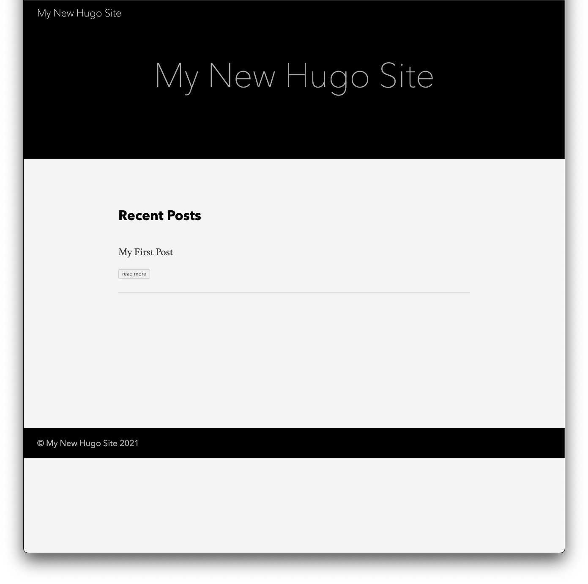

[@su2umaru](https://twitter.com/su2umaru) です。Hugo + Netlify で自作ブログを開発しました。Hugo のチュートリアルからブログ開設までを振り返り、無料でイケてるブログやサイトを開発・運用する方法を書きます。

<!--more-->

## 静的サイトジェネレータ Hugo

[前回の記事「ブログを開設しました」](https://su2umarathon.netlify.app/first-post/)で書いたように、[Hugo](https://gohugo.io/) は静的サイトジェネレータです。高速、柔軟、マークダウン対応という特徴があります。

同じく静的サイトジェネレータとして有名な [Gatsby.js](https://www.gatsbyjs.com/), [Jekyll](http://jekyllrb-ja.github.io/), [Pelican](https://docs.getpelican.com/en/latest/) よりイケてるテーマが多かったので Hugo を選びました。

## Hugo のチュートリアル

まずは [Hugo のチュートリアル](https://gohugo.io/getting-started/quick-start/)から取り組みました。7ステップで Hugo のインストールからブログの構築までできました。

「完全に理解した」

## uBlogger テーマのインストールと設定

チュートリアルを終えたので、いよいよ自作ブログの開発です。

今回開発したいのはブログなので、[テーマ](https://themes.gohugo.io/)の Tags から Blog を指定しました。イケてるテーマが多かったので、先にほしい機能を洗い出しました。

- マークダウン対応
- タグ
- 目次
- SNS シェア
- ダーク/ライト切り替え
- サムネイル

最終的に [uBlogger](https://themes.gohugo.io/ublogger/) を選びました。上記の機能を全て備えているテーマの中から、最後は直感で選びました。この記事を読んでくださっている方、せっかくなので SNS シェアやダーク/ライト切り替え機能を使ってみてください。

テーマを決めていざ開発を始めたものの、すぐに手が止まりました。

「ドキュメントが見当たらない」

[uBlogger の GitHub](https://github.com/uPagge/uBlogger) にはドキュメントどころか、インストールの手順すら書いてありませんでした。頼れるものがないので自力で開発するしかありませんでした。試行錯誤の結果、折れました。

「いきなりブログは早かったかな」

「ホームページから初めてスモールスタートの方が良かったかな」

かなり弱気でした。

「苦しいけど、やっぱり自作ブログを完成させたい」

その一心で、走り続けました。

結局、今こうして皆さんがこの記事を読んでくださっているということは、無事にドキュメントが見つかったということです。なんと [uBlogger のデモページ](https://ublogger.netlify.app/theme-documentation-basics/)にありました。諦めなければなんとかなるものです。

ドキュメントに沿って uBlogger をデフォルトの設定で立ち上げることに成功しました。

「やっとできた」

まだ完成していないのに、とても嬉しかったです。苦しんだ分だけ、見返りは大きかったです。

テンションが上がったところで、勢いそのままに設定やレイアウトを変更していきました。

- メニューから [Docs](https://ublogger.netlify.app/categories/documentation/) を削除した
- [algolia](https://www.algolia.com/) による検索機能を削除した
- SNS リンクを [GitHub](https://github.com/su2umaru) と [Twitter](https://twitter.com/su2umaru) に限定した
- 日付表記を「2006-01-02」から「2006/01/02」に変更した
- 記事の最後のプロフィールに [GitHub](https://github.com/su2umaru) と [Twitter](https://twitter.com/su2umaru) を追加した

ここで最も気をつけなければいけないことは、テーマを直接編集しないことです。なぜならテーマはテーマの開発者によって更新されてしまうためです。その更新を反映したときに、これまでの編集が消えてしまいます。

直接編集することなく設定やレイアウトを変更するために、テーマ内の編集したいファイルと同じディレクトリ構造を、自身の環境に再現します。

例えば記事の最後のプロフィールを編集したい場合は `(ブログのルート)/themes/uBlogger/layouts/partials/home/profile.html` を編集するのではなく `(ブログのルート)/layouts/partials/home/profile.html` を新たに作成します。これでテーマの更新による影響を受けなくなります。ここで `(ブログのルート)/themes/uBlogger/layouts/partials/home/profile.html` を `(ブログのルート)/layouts/partials/home/profile.html` にコピーした段階でコミットしておくと編集箇所がわかりやすくなります。

編集の手順をまとめておきます。

1. ブラウザで編集箇所をドラッグにより選択する
2. Inspect (`Command` + `Option` + `C`) で要素を確認する
3. [Sourcegraph](https://about.sourcegraph.com/) ([chrome 拡張機能](https://chrome.google.com/webstore/detail/sourcegraph/dgjhfomjieaadpoljlnidmbgkdffpack)) で編集するファイルを探す
4. VSCode でファイルを編集する

Sourcegraph にはとてもお世話になりました。世の中には便利なものがたくさんあります。僕も便利なものを作る人間になりたいです。

地道な作業を経て、設定やレイアウトの変更が完了しました。

「僕でもできた」

また達成感を得られました。

## Netlify によるデプロイ

ローカルで立ち上げるだけでは、皆さんが読んでくださるブログになりません。皆さんが http://localhost:1313/ にアクセスすることができても、それは皆さんの localhost であり、僕の localhost ではないためです。

皆さんが読んでくださるブログにするために、デプロイする必要があります。ホスティングサービスを [Netlify](https://www.netlify.com/), [GitHub Pages](https://docs.github.com/ja/github/working-with-github-pages/about-github-pages), [Firebase](https://firebase.google.com/?hl=ja) のどれにするか迷いましたが、人気そうだったので Netlify を選びました。

[Hugo の公式サイト](https://gohugo.io/hosting-and-deployment/hosting-on-netlify/)を参考にデプロイしました。

## Google Analytics の設定

## Google Search Console の設定

## Upptime による監視