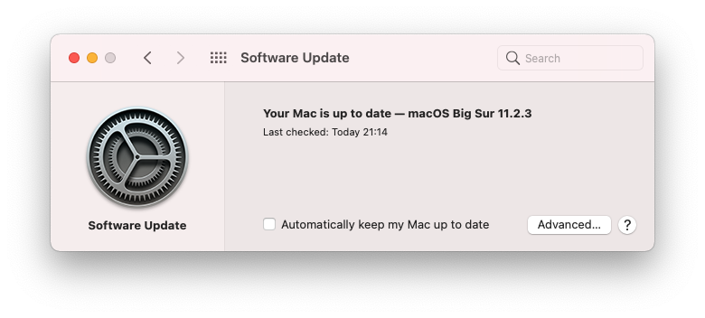

[@su2umaru](https://twitter.com/su2umaru) です。M1 Mac mini を購入しました。M1 Mac mini を購入した理由と、M1 Mac mini の初期設定について書きます。

<!--more-->

## M1 Mac mini を購入した理由

## MacBook Pro と M1 Mac mini の比較

## M1 Mac mini の開封

## M1 Mac mini の初期設定

実際に M1 Mac mini の初期設定を行いました。

まずは設定アシスタントに従って初期設定を行いました。

初期設定が終わると Mac のお馴染みのデスクトップが現れます。

早速ですが、ここで OS をアップデートします。新品の Mac は OS が最新ではないことが多いです。Apple Menu :apple: > System Preferences > Software Update から OS をアップデートします。

アップデートが完了すると「Your Mac is up to date」と表示されます。

ここで Mac のスペックを確認しておきます。今回はメモリ 16GB、ストレージ 512GB の M1 Mac mini を購入しました。機種とメモリは Apple Menu :apple: > About This Mac > Overview から、ストレージは Apple Menu :apple: > About This Mac > Storage から確認できます。

機種は M1 Mac mini、メモリは 16GB と確認できました。しかしストレージが 494.38GB と少し足りません。Apple サポートへ問い合わせたところ、Intel Mac ではスペックの容量が表示されていたのに対して、M1 Mac では実際に使用できる容量が表示されるようになったようです。

スペックが確認できたところで見た目を設定します。Apple Menu :apple: > System Preferences > General からダークモードに変更します。

Apple Menu :apple: > System Preferences > Desktop & Screen Saver から背景を変更します。

Apple Menu :apple: > System Preferences > Display から Night Shift を設定します。Night Shift を設定することでブルーライトを低減します。

以上で見た目が設定できました。

次に System Preferences から設定できる他の項目を設定します。

トラックパッドだけ先に設定してしまいます。Apple Menu :apple: > System Preferences > Trackpad からクリックの重さとトラッキングスピードを変更します。

また More Gestures の Swipe between pages をオフ、App Expose をオンにします。

ここからは System Preferences に表示されている順に設定します。Apple ID では次の項目をオンにします。

- Notes
- Find My Mac
- Siri

General では Ask to keep changes when closing documents をオンにします。

Dock & Menu Bar では Dock や Menu Bar を設定します。僕は最初に Dock に表示されているアプリケーションを全て Dock から削除します。使っているアプリケーションだけ表示するためです。また普段 Dock を非表示にしています。

Menu Bar には次の項目を表示します。

- Wi-Fi
- Bluetooth
- Now Playing
- Clock (24時間表示、秒も表示)

Mission Control はスペース、ウィンドウ、アプリケーションを簡単に切り替えられる機能です。

Language & Region では言語を設定します。

Notifications では次の項目をオンにします。スタイルは Banners、Show previews は always に設定します。

- FaceTime
- Messages

Extension の Share Menu では AirDrop を最も上に設定します。

Security & Privacy では Require password を immediately、FileVault をオン、Firewall をオンにします。

Software Update では Automatically keep my Mac up to date をオンにします。

Network では Wi-Fi や VPN を設定します。

Sound では Play sound on startup をオフにします。

Keyboard では Key Repeat を最も速く、Delay Until Repeat を最も短く設定します。また Caps Lock Key に Control を割り当てます。Text では全てのチェックボックスをオフにします。Shortcuts では Spotlight のチェックボックスをオフにします。Input Sources では ¥ キーで \ が入力されるよう設定します。

Energy Saver では Turn display off after を3分に設定し、全てのチェックボックスをオフにします。

Sharing ではコンピュータ名を変更します。

以上で System Preferences から設定できる項目が設定できました。

## プリインストールされているアプリケーションの設定

Mac にはプリインストールされているアプリケーションがあります。それらの設定を行います。

### Finder

Finder Preferences > General から Connected servers をオンにします。また新しいウィンドウの立ち上げをホームディレクトリ(ユーザ名のディレクトリ)に設定します。

Finder Preferences > Sidebar から次の項目をオンにします。

- Recents
- Applications
- Downloads
- ホームディレクトリ(ユーザ名のディレクトリ)
- External disks
- CDs, DVDs, and iOS Devices
- Cloud Storage
- Bonjour computers
- Connected Servers
- Recent tags

Finder Preferences > Advanced から Show all filename extensions をオンにします。

Views > Show Preview をオンにします。

Views > Show Path Bar をオンに、Views > Show Status Bar をオンにします。

Views > Show View Options からテキストサイズを14、Use relative dates をオン、Calculate all sizes をオン、Show icon preview をオンにします。そして Use as Defaults をクリックします。

Views > Customize Toolbar からツールバーに Path を追加します。

### Screenshot

`Command` + `Shift` + `5` で立ち上がり、Options から Show Floating Thumbnail をオフにします。

### App Store

iCloud にログイン後、プリインストールされているアプリケーションをアップデートします。

## アプリケーションのインストール

Mac にアプリケーションをインストールします。M1 であることに注意しながらインストールしていきます。アプリケーションが M1 Mac に対応しているか否かは [is apple silicon ready?](https://isapplesiliconready.com/) で確認できます。

### Google Chrome

まずは [Google Chrome](https://www.google.com/intl/ja/chrome/) です。Safari で Google Chrome って検索するの裏切り感ありますよね。

インストール後、Google Chrome を立ち上げるとデフォルトのブラウザに設定できます。

Google アカウントでログインします。するとブックマークや拡張機能が同期されます。

### Alfred

[Alfred](https://www.alfredapp.com/) は Spotlight のようなランチャーアプリです。アプリケーションの立ち上げに加え、ファイルやフォルダの検索、ブラウザのブックマークの検索、Mac のシステム操作もできます。

M1 Mac 向けに [Apple Universal Build](https://www.alfredapp.com/universal/) が用意されています。

インストール後、Alfred Preferences > General で Alfred Hotkey を `Command` + `Space` に設定します。Where are you に Japan を設定します。Permissions の Accessibility、Full Disk Access、Automation をオンにします。

Alfred Preferences > Features > Default Results で Extras の Folders をオンにします。

Alfred Preferences > Features > Web Bookmarks で Sources の Google Chrome Bookmarks をオンにします。

### Karabiner-Elements

[Karabiner-Elements](https://karabiner-elements.pqrs.org/) はキーボードをカスタマイズするアプリケーションです。僕のキーボードは US 配列なので英数/かな切り替えができません。しかし Karabiner-Elements を使うと、左 Command キーに英数への切り替え、右 Command キーにかなへの切り替えを割り当てられます。

インストール後、Complex modifications で左下の Add rule > Import more rules from the internet (open a web browser) をクリックします。japanese と検索し、For Japanese （日本語環境向けの設定）をインポートします。

インポートすると Karabiner-Elements に戻り、インポートした設定が表示されます。

このうち3つを Enable にします。

- コマンドキーを単体で押したときに、英数・かなキーを送信する。（左コマンドキーは英数、右コマンドキーはかな） (rev 3)
- escキーを押したときに、英数キーも送信する（vim用）
- Ctrl+[を押したときに、英数キーも送信する（vim用） (rev 2)

これで人権を得ました。

同様に Left ctrl + hjkl to Arrow Keys Vim をインポートします。これは左 Ctrl キーと hjkl キーで Vim ライクにカーソルを移動できる設定です。

また Fn キーは全て Fn キーとして機能するよう設定します。

### Rectangle

[Rectangle](https://rectangleapp.com/) は macOS 用のウィンドウマネージャです。僕はこれまで [ShiftIt](https://github.com/fikovnik/ShiftIt) を愛用していたのですが、開発が止まっているようです。ShiftIt は代わりに [Hammerspoon](http://www.hammerspoon.org/) を勧めていましたが、設定が複雑と思いました。ShiftIt と並んで [Spectacle](https://www.spectacleapp.com/) が有名なようですが、Spectacle も開発が止まっているようです。Spectacle は代わりに Rectangle を勧めていて、Rectangle は GUI で設定できるため Rectangle を選びました。

インストール後、GUI で設定します。

### Clipy

※[Rosetta](https://support.apple.com/ja-jp/HT211861) をインストールする必要があります。

[Clipy](https://clipy-app.com/) は macOS 用のスニペットアプリです。通常は直近のコピーしかペーストできませんが、Clipy を使うとコピーの履歴を辿れます。またスニペットとして定型文を登録しておくことで、いつでもペーストできます。

インストール後、Clipy を起動すると Rosetta 2 をインストールするよう要求されました。[is apple silicon ready?](https://isapplesiliconready.com/) で確認すると M1 Mac に対応していないようです。代替アプリが見つからなかったので Rosetta 2 をインストールしました。Rosetta 2 をインストールすると無事に Clipy が起動しました。メールアドレスをスニペットとして登録しました。

### AppCleaner

不要になったアプリを削除するときにアプリ本体だけ削除すると設定ファイルが残ってしまいます。設定ファイルごと削除してくれるのが [AppCleaner](https://freemacsoft.net/appcleaner/) です。

インストール後、立ち上げると Drop your apps here という画面が現れます。ここにアプリをドラッグ&ドロップすることで設定ファイルごとアプリを削除できます。

### Spark

※[Rosetta](https://support.apple.com/ja-jp/HT211861) をインストールする必要があります。

[Spark](https://sparkmailapp.com/ja) はメールクライアントアプリです。iCloud アカウントと他のメールアドレスが紐付き、各デバイスの Spark で iCloud アカウントにログインするだけで全てのメールアドレスを扱えます。例えば僕が使っていた MacBook Pro の Spark にはメールアドレスが5つ登録されていますが、新しい M1 Mac mini では iCloud アカウントにログインするだけで iCloud アカウントと他の4つも使えます。一方、プリインストールされている Mail アプリだと M1 Mac mini でも5つにログインする必要があります。

[is apple silicon ready?](https://isapplesiliconready.com/) で確認すると Spark も Clipy と同様に M1 Mac に対応していないようです。しかし Clipy のインストール時に Rosetta 2をインストールしたので、何もすることなく Spark をインストールできました。

### Slack

[Slack](https://slack.com/intl/ja-jp/) は言わずと知れたチャットアプリです。所属しているコミュニティごとにワークスペースがあり、Slack がないと仕事になりません。また僕は1人用のワークスペースを開設していて、リマインダーや Incoming Webhook を使っています。

### Microsoft Office

[Microsoft Office](https://www.microsoft.com/ja-jp/microsoft-365) は言わずと知れたオフィススイートです。僕が Microsoft Office を拒んでも、求められるシーンが多々あります。そのためインストールしておきます。ただ Teams は使わないのでインストールしません。

### Amphetamine

[Amphetamine](https://apps.apple.com/jp/app/amphetamine/id937984704?mt=12) はワンクリックで Mac をスリープさせないようにするアプリケーションです。

インストール後、設定します。

### Bandwidth+

※[Rosetta](https://support.apple.com/ja-jp/HT211861) をインストールする必要があります。

[Bandwidth+](https://apps.apple.com/jp/app/bandwidth/id490461369?mt=12) は通信量をリアルタイムに表示するアプリです。Mac の動作が止まったときに、CPU が原因かネットワークが原因かわかりません。通信量が十分か否か確認することで、どちらか判断しています。

### Discord

※[Rosetta](https://support.apple.com/ja-jp/HT211861) をインストールする必要があります。

[Discord](https://discord.com/) はゲーマー用のボイスチャットアプリです。

Discord も M1 Mac に対応していません。有名だからといって M1 Mac に対応しているわけではないようです。

### Docker

※[Rosetta](https://support.apple.com/ja-jp/HT211861) をインストールする必要があります。

[Docker](https://www.docker.com/) はコンテナ仮想化を用いてアプリケーションを開発、実行するためのソフトウェアです。Docker がないと仕事になりません。

### Fuwari

※[Rosetta](https://support.apple.com/ja-jp/HT211861) をインストールする必要があります。

[Fuwari](https://fuwari-app.com/) はスクリーンショット拡張アプリです。画面の任意の範囲を一時的に最前面に配置できます。

### バックアップと同期

※[Rosetta](https://support.apple.com/ja-jp/HT211861) をインストールする必要があります。

[バックアップと同期](https://support.google.com/drive/answer/2374987?hl=ja)は Google ドライブでパソコンのファイルをバックアップして同期するアプリケーションです。同期するフォルダを指定すれば、フォルダの中身が変わったタイミングで自動的に Google ドライブと同期してくれます。

以前は[パソコン版 Google ドライブ](https://support.google.com/a/answer/7491144?utm_medium=et&utm_source=aboutdrive&utm_content=getstarted&utm_campaign=en_us&hl=ja)を使っていましたが、定期的に手動で同期しなければならないのが手間でした。そのため今回はバックアップと同期をインストールしました。

### iTerm2

[iTerm2](https://iterm2.com/) は macOS 用のターミナルエミュレータです。Mac には Terminal.app がプリインストールされていますが、iTerm2 の方が見た目やショートカットの豊富さで優れています。

iTerm2 ではフォントに [FiraCode](https://github.com/tonsky/FiraCode)、カラーに [Dracula](https://draculatheme.com/iterm)、プラグインマネージャに [Prezto](https://github.com/sorin-ionescu/prezto)、テーマに [Powerlevel10k](https://github.com/romkatv/powerlevel10k) を使っています。

### MeetingBar

[MeetingBar](https://github.com/leits/MeetingBar) は Mac のメニューバーにカレンダーの予定を表示するアプリケーションです。MeetingBar を起動するとどのカレンダーの予定を表示するか選択しなければならないため、先に Mac の Calendar.app を設定しておきます。Calendar.app には Google カレンダーを読み込ませます。

### Notion

[Notion](https://www.notion.so/) はドキュメント管理アプリケーションです。The all-in-one workspace と謳っていて、多様なデータをそれぞれに適した形で管理することができます。僕は日記、タスク管理、リーディングリストに使っています。

デフォルトではカラーが Light になっているため、System Preference に合わせます。

### RunCat

[RunCat](https://kyome.io/runcat/) は Mac のメニューバー~~でネコを飼う~~に CPU 使用率を表示するアプリです。ちなみに僕は良い夢を見られるように羊を飼っています。

### Snap Camera

[Snap Camera](https://snapcamera.snapchat.com/) はカメラアプリです。オンライン会議で加工したり背景を設定したりできます。Snap Camera で加工、Zoom で背景を設定、という使い方もできます。

### TweetDeck

[TweetDeck](https://tweetdeck.twitter.com/) は複数のタイムラインを統合できるアプリケーションです。複数の Twitter アカウントの管理、ツイートの予約投稿、ツイートのコレクションの作成、といった高度な機能が用意されています。

### Visual Studio Code

[Visual Studio Code](https://azure.microsoft.com/ja-jp/products/visual-studio-code/) はとりあえず入れておけば間違いない強力で軽量なエディタです。VSCode がないと仕事になりません。GitHub アカウントで同期すると設定と拡張機能を同期できます。

### Zoom

[Zoom](https://zoom.us/jp-jp/meetings.html) はビデオ会議アプリケーションです。リモートワークが普及してから、一気に有名になりました。今のご時世、Zoom がないと仕事になりません。Zoom がなくても仕事ができる世の中が1日でも早く来ることを待っています。

## M1 Mac mini を使い倒す

M1 Mac mini の初期設定は以上です。しかし今後の作業内容の変化に伴い、ベストな設定も変化します。適宜、アプリケーションを追加したり、設定を変更したりしていきます。M1 Mac mini を使い倒します。